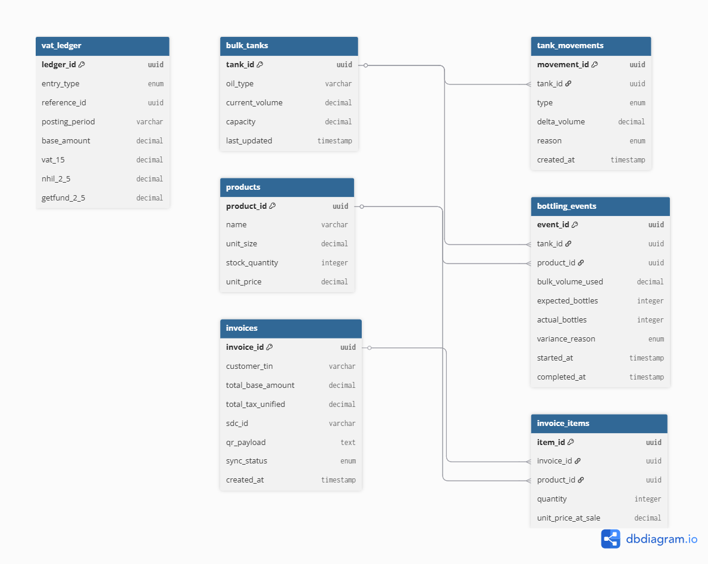

# E-VAT Compliant Inventory & Sales System 🇬🇭

A resilient, **offline-first** ERP system designed for Ghanaian manufacturers (focused on the edible oil industry). This platform ensures compliance with the **2026 GRA E-VAT mandate** while providing robust inventory monitoring and anomaly detection.

## 🚀 The Vision
In many parts of Ghana, like Kumasi, unreliable internet shouldn't stop a business from being compliant. This system bridges the gap between manual local operations and digital government oversight, ensuring every drop of oil is accounted for and every tax Cedi is recorded.

## 🛠️ Tech Stack
- **Frontend:** Flutter (Mobile App)
- **Backend:** Go (Golang)
- **Database:** PostgreSQL (Cloud) & SQLite (Local Mobile)
- **Architecture:** Local-First with Background Synchronization

## 📊 System Architecture (ERD)

*Note: The system utilizes a dual-ledger approach to track Input VAT (Imports) vs. Output VAT (Sales) and includes a specialized module for "Yield Reconciliation" to detect inventory leakage.*

## ✨ Key Features
- **Offline Sales:** Record transactions without internet; auto-syncs to the GRA within the mandatory 24-hour window.
- **GRA Handshake:** Automated generation of 16-digit SDC signatures and QR-coded receipts.
- **Anomaly Detection:** Rule-based monitoring of "Bulk-to-Bottle" transformations to flag theft or spillage.
- **Dual-Ledger VAT:** Automated calculation of the unified 20% tax rate (15% VAT + 5% Levies).

## 📁 Project Structure
- `/mobile_flutter`: The agent-facing mobile application.
- `/backend-go`: Central API for data aggregation and GRA communication.
- `/mock-gra-api`: A simulation of the Ghana Revenue Authority's digital clearance system.
